# ATLETIZA

## Relatório Final — Hackathon

### Avaliação de Desempenho e Entrega Técnica

**Centro Universitário Geraldo Di Biase — UGB/FERP**
Curso de Sistemas de Informação
Volta Redonda, 12 de junho de 2026

---

## 1. Identificação

**Nome do projeto:** ATLETIZA *(originalmente apresentado como "UniHub"; o nome evoluiu para ATLETIZA durante o processo)*

**Integrantes:**

- Felipe
- Gabriel Fernandes
- André Gustavo Melo da Silva
- Júlia de Oliveira Martins
- Luiz Filipe Silva Rocha

**Repositório:** https://github.com/Felipe-Alcantara/UniHub

> Observação: o repositório mantém o nome `UniHub` por motivos históricos. O produto foi renomeado para **ATLETIZA** durante o desenvolvimento.

---

## 2. Documentação da Solução *(1,5 pts)*

### 2.1 O problema

As atléticas universitárias enfrentam um problema crônico de **dispersão de informação e fragmentação da comunicação**. Hoje, o que uma atlética precisa comunicar aos alunos fica espalhado entre:

- grupos de WhatsApp,
- posts e stories no Instagram,
- planilhas compartilhadas,
- mensagens privadas avulsas.

Esse modelo gera dois efeitos negativos:

- **Para os alunos:** perda de informação. Eventos, treinos, modalidades e serviços ficam difíceis de encontrar, e muita gente simplesmente não fica sabendo do que está acontecendo.
- **Para a diretoria:** retrabalho constante. As mesmas informações precisam ser republicadas em vários canais, e processos como inscrição em modalidades, seletivas e listas de presença são administrados manualmente, sem um fluxo organizado.

O ATLETIZA ataca a **raiz** desse problema: centraliza treinos, eventos, modalidades, links, vitrine e comunicação em um único fluxo navegável, especializado nas regras reais do ecossistema de atléticas (modalidades de entrada livre x seletiva, eventos públicos x privados, aprovações, listas de presença).

### 2.2 Arquitetura técnica

A solução é uma **aplicação web responsiva mobile-first**, dividida em frontend e backend desacoplados.

**Frontend**

- **React 18** — biblioteca de interface
- **Vite 6** — build e dev server
- **TailwindCSS 3** — estilização utilitária e responsividade mobile-first
- **Framer Motion** — animações e transições
- **Lucide React** — iconografia
- **React Router DOM 6** — navegação entre telas

**Backend**

- **Django** — framework web
- **Django REST Framework** — camada de API
- **SQLite** — banco de dados

**Testes**

- **Vitest** — testes unitários e de regras de negócio
- **Testing Library** — testes de componentes React

**Justificativa das escolhas (criatividade na restrição de 48h):** a stack foi escolhida priorizando velocidade de entrega e tecnologias acessíveis. React + Vite + Tailwind permitem construir uma interface caprichada e responsiva rapidamente; Django + DRF oferecem um backend convencional e sólido sem depender de infraestrutura inacessível. O resultado é um MVP que roda localmente para a demonstração, mas que permanece **tecnicamente viável e evolutivo** para uso real após a apresentação.

---

## 3. Entrega do Produto / MVP *(2,5 pts)*

### 3.1 Repositório

🔗 **https://github.com/Felipe-Alcantara/UniHub**

### 3.2 Funcionalidades implementadas com sucesso

O MVP é navegável de ponta a ponta. As telas implementadas e funcionais são:

| Funcionalidade | Descrição |
|---|---|
| **Autenticação** | Login com e-mail e senha validados no backend (Django). Suporte a perfis: aluno, diretoria e dev/admin. |
| **Home / Landing interna** | Tela pós-login com resumo do aluno, destaques e acesso rápido às áreas do hub. |
| **Agenda** | Listagem de eventos e treinos com filtros por tipo, visibilidade e modalidade. |
| **Eventos e treinos** | Tela de detalhe com regra de confirmação de presença. |
| **Modalidades** | Estados de relacionamento do aluno com a modalidade: participante, não participante, solicitação pendente, rejeitado, entrada livre e seletiva necessária. |
| **Links importantes** | Central de acesso rápido aos links da atlética. |
| **Vitrine de produtos** | Busca, filtro por categoria e contato simulado (sem checkout). |
| **Carteirinha digital** | Versão mockada da carteirinha do aluno. |
| **Mural** | Avisos e enquetes. |
| **Painel da diretoria** | Criação/edição visual de eventos, treinos, modalidades, links e produtos; aprovação/rejeição de seletivas; lista de presença de eventos gratuitos. |
| **Horas complementares** | Tela de acompanhamento de horas complementares. |

### 3.3 O que está consciente como mockado

Em transparência com a avaliação, o MVP deixa explícito o que ainda é simulado nesta versão:

- Dados de usuários, eventos, modalidades, links, produtos, avisos e enquetes (persistência apenas em estado local);
- Fluxos administrativos do painel da diretoria;
- Carteirinha digital e contato da vitrine.

O **login é o fluxo realmente integrado ao backend** neste ciclo. As demais áreas são alimentadas por mocks estruturados (`frontend/src/data/mock*.js`), o que mantém a demo honesta e, ao mesmo tempo, deixa o caminho aberto para a integração real com a API.

### 3.4 Qualidade e testes

Foi aplicado **TDD pragmático** sobre as regras de negócio centrais, com cobertura em:

- filtro da agenda;
- visibilidade público/privado;
- entrada livre x seletiva;
- confirmação de presença;
- controle de acesso aluno x diretoria/admin.

### 3.5 Capturas de tela

Prints capturados da aplicação em execução local (sessão real de aluno e de diretoria):

| | |
|:---:|:---:|
| 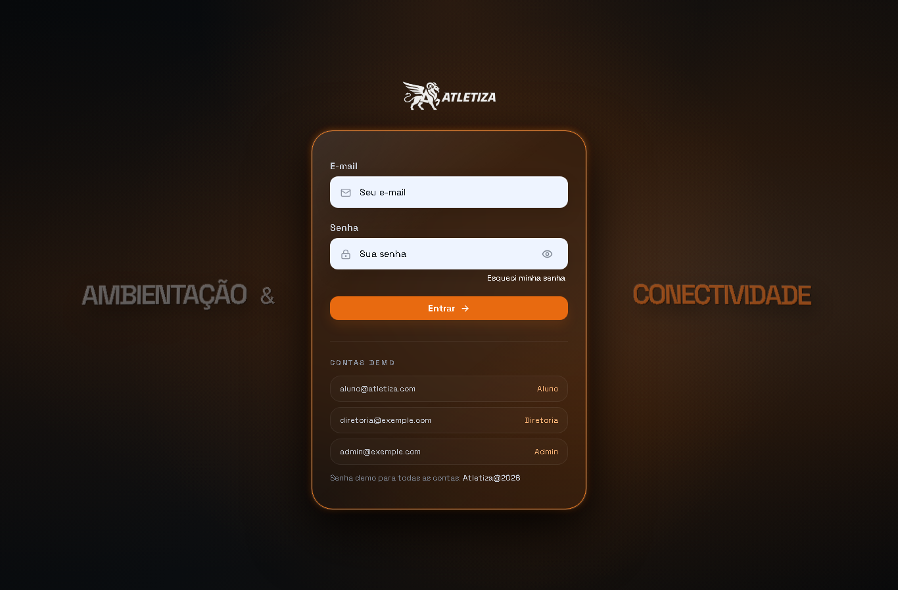 | 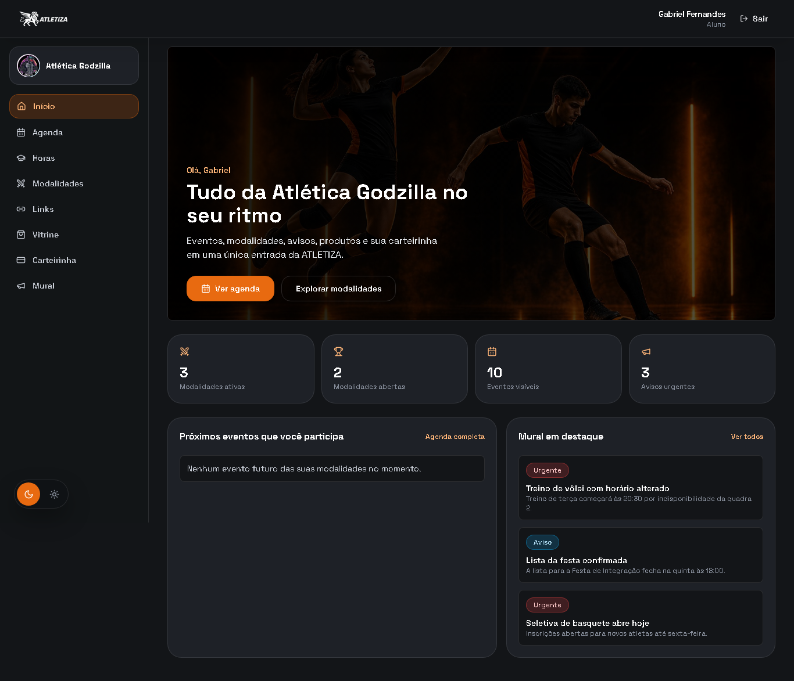 |
| **Login** — autenticação com contas demo | **Home** — resumo do aluno e acessos rápidos |
| 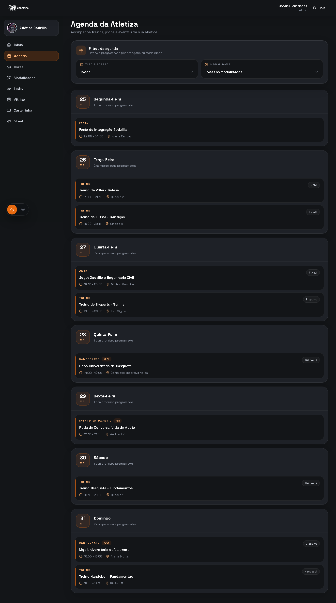 | 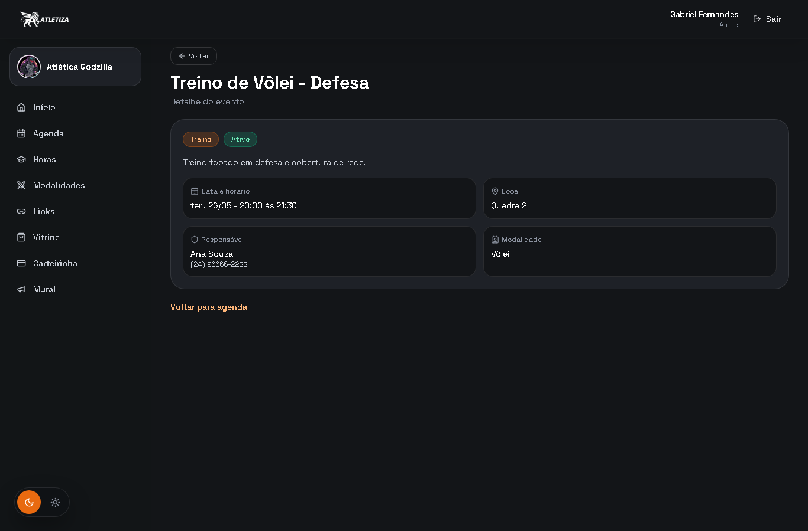 |
| **Agenda** — eventos e treinos com filtros | **Detalhe de evento/treino** |
| 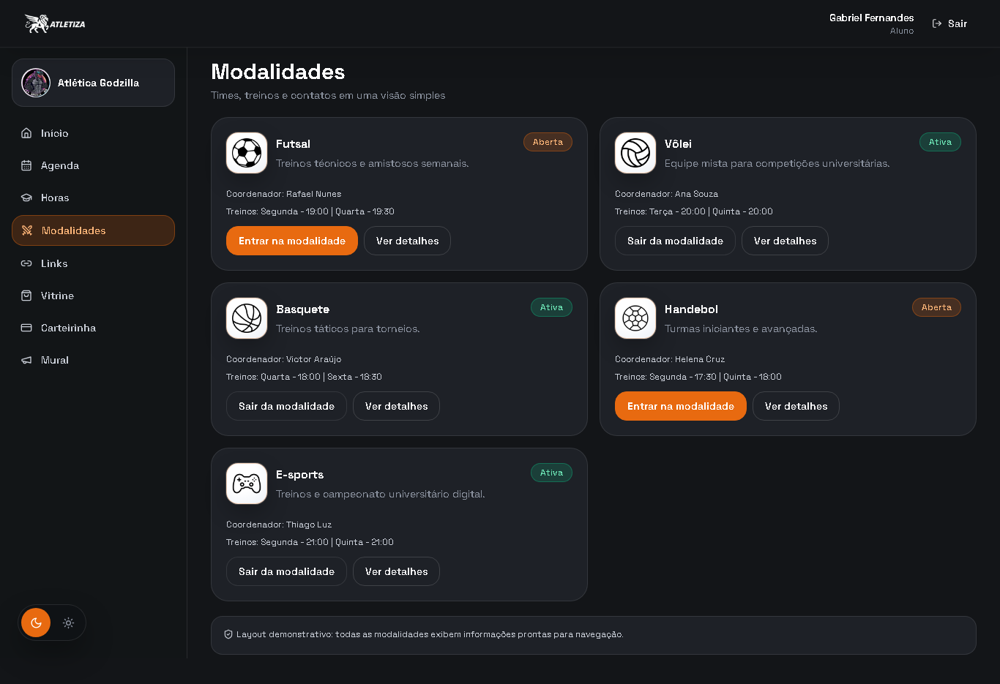 | 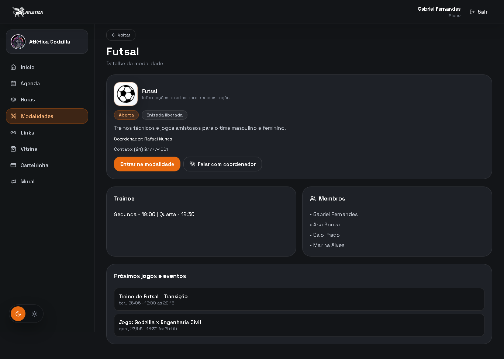 |
| **Modalidades** — estados de inscrição | **Detalhe da modalidade** — entrar, treinos, membros |
| 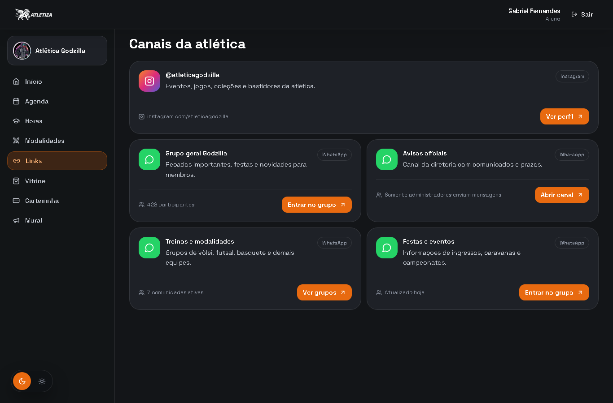 | 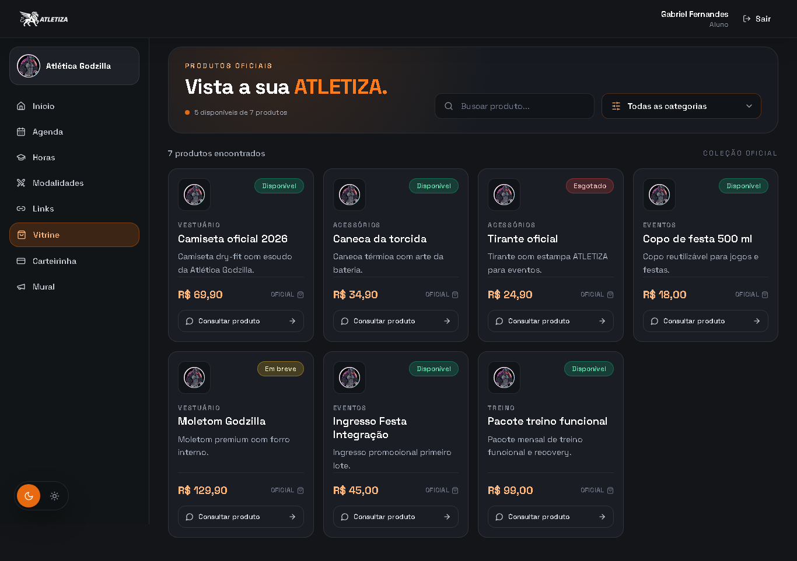 |
| **Links importantes** | **Vitrine de produtos** — busca e filtros |
| 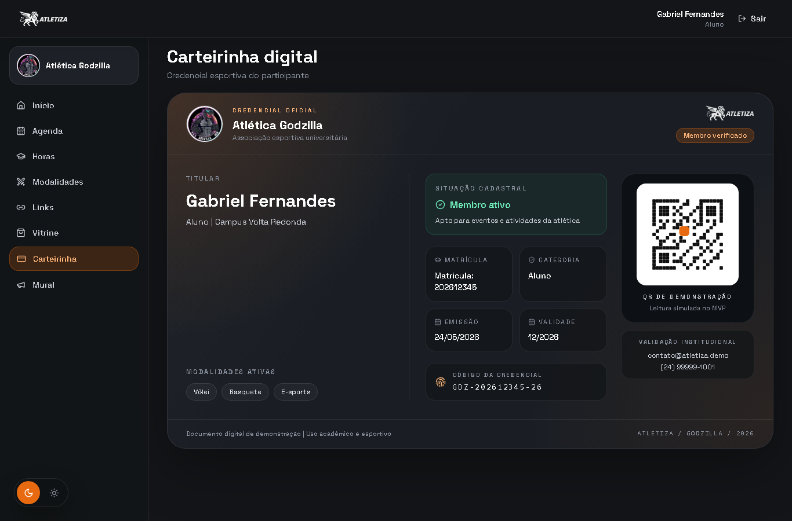 | 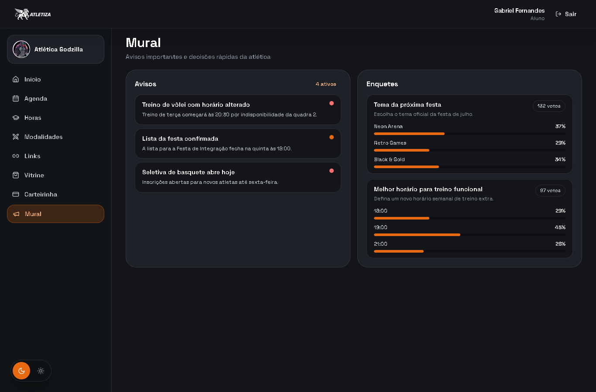 |
| **Carteirinha digital** | **Mural** — avisos e enquetes |
| 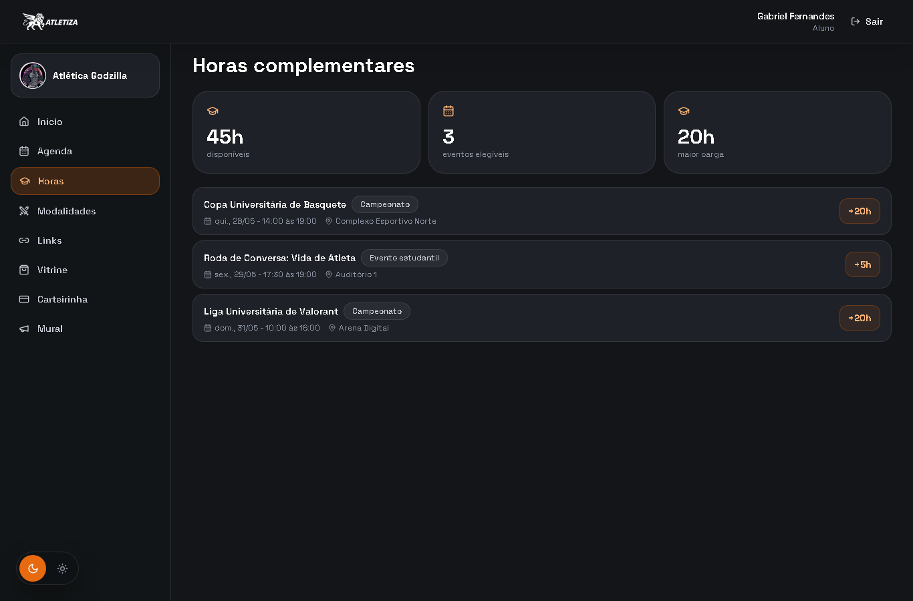 | |
| **Horas complementares** | |

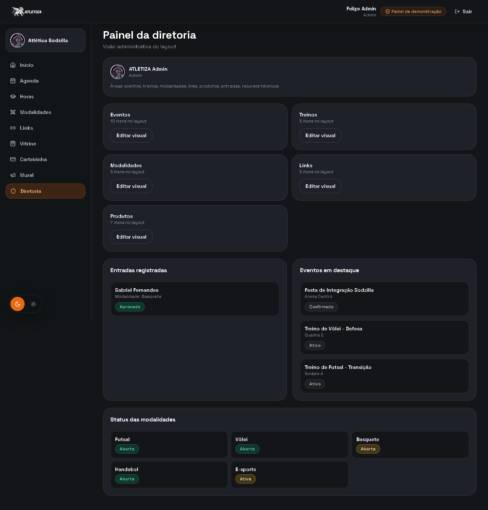

**Painel da diretoria** — gestão de eventos, treinos, modalidades, links, produtos e entradas.

---

## 4. Relatório de Participação e Processo *(3,0 pts)*

### 4.1 Divisão de tarefas

As responsabilidades foram distribuídas conforme a **familiaridade e o ponto forte de cada integrante**, o que permitiu paralelizar o trabalho e aproveitar ao máximo a janela de 48 horas:

| Integrante | Responsabilidade |
|---|---|
| **Gabriel** | Documentação |
| **Felipe** | Arquitetura |
| **André** | Front-end |
| **Júlia** | Design |
| **Luiz** | Back-end |

### 4.2 Gestão e Colaboração

A organização do grupo partiu de uma premissa simples: **cada pessoa atua onde tem mais domínio**. Em vez de distribuir tarefas aleatoriamente, mapeamos a familiaridade de cada integrante e alocamos as frentes de acordo — Felipe na definição da arquitetura técnica, Luiz no back-end, André no front-end, Júlia no design e identidade visual e Gabriel na documentação.

Essa divisão por afinidade reduziu a curva de aprendizado durante o evento e permitiu que cada frente avançasse em paralelo. O fluxo de trabalho seguiu um **workflow Git disciplinado**: branch por feature, ciclo de implementar → testar → validar → documentar, abertura de Pull Request e remoção da branch após o merge, evitando trabalho direto na `main`.

### 4.3 Desafios Superados

Os principais obstáculos enfrentados durante o evento foram de **negócio (domínio)** mais do que puramente técnicos:

- **Entender o domínio das atléticas (Atletiza):** o maior desafio foi modelar corretamente o funcionamento real de uma atlética. Foi preciso compreender e traduzir em software as regras de **comunidades** e de **administração de atléticas** — como funcionam as modalidades, a diferença entre entrada livre e seletiva, eventos públicos x privados, os fluxos de aprovação/rejeição e as listas de presença.
- **Problemas de comunicação e administração:** justamente a dor que o produto resolve foi também o desafio de design — estruturar uma interface que organizasse informação dispersa e fluxos administrativos de forma intuitiva, sem sobrecarregar o usuário.

**Como solucionamos:** decidimos por um **MVP honesto e navegável**. Em vez de tentar integrar tudo ao backend dentro das 48 horas (o que seria inviável), priorizamos um produto completo na navegação e na experiência, com as regras de negócio implementadas e testadas, e com o que ainda é simulado claramente identificado. Isso permitiu entregar algo coeso, demonstrável e evolutivo dentro da restrição de tempo.

### 4.4 Autoavaliação

O grupo avalia o resultado final de forma **positiva**. Conseguimos entregar um MVP navegável de ponta a ponta, com identidade visual consistente, fluxos lógicos de navegação e as regras de negócio centrais das atléticas implementadas e cobertas por testes. O login está realmente integrado ao backend, e todas as telas planejadas — home, agenda, eventos, modalidades, links, vitrine, carteirinha, mural e painel da diretoria — ficaram prontas e funcionais para a demonstração.

Reconhecemos com transparência as limitações do ciclo: boa parte do conteúdo ainda é alimentada por mocks e não há, nesta versão, recuperação automática de sessão, checkout/pagamentos ou check-in. Ainda assim, consideramos que o produto cumpriu o objetivo da restrição de 48 horas: não é uma ficção visual, e sim uma base **real, viável e evolutiva**. Com mais tempo de desenvolvimento, o caminho para transformá-lo em um produto efetivamente utilizável já está estruturado.

---

## 5. Visão Futura

Próximos passos planejados para evolução do produto:

- restauração automática de sessão autenticada;
- API completa integrada ao frontend;
- permissões persistidas;
- inscrições reais em modalidades e aprovação real de seletivas;
- integração com WhatsApp/Instagram;
- pagamentos externos;
- relatórios da diretoria;
- suporte multiatléticas;
- deploy em produção.

---

*Relatório referente à entrega técnica do Hackathon — projeto ATLETIZA.*
